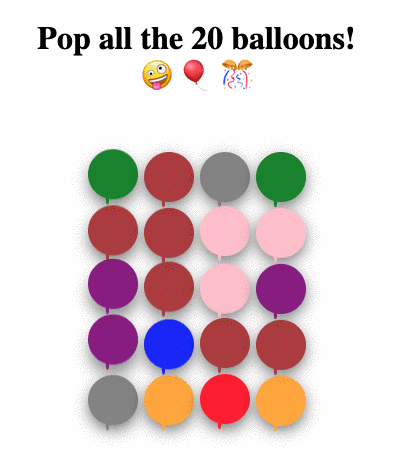
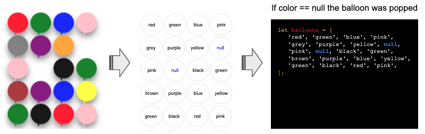

# 🎈🎊 Pop Balloons game using Javascript, HTML/CSS

This is an amazing game to practice HTML, CSS and a little Javascript.
The game goal is to POP al the balloons by clicking on them.

# 📝 Instructions



Build a game with the following workflow:

1. When the website loads (`window.onload`) you have to render all the ballons.
2. Every ballon needs to have an onClick attached to listen to when the user clicks on it.
3. When the user clicks on it the balloon disappears (pops) from the screen.
4. When all the 20 balloons have disappeared the website reloads and the game starts again.

# 💪 Strategy



1. First, declare an array of 20 colors, each color will represent a balloon, the colors can repeat.
2. To pop a balloon, you will have to turn the value on that balloon position on the array equal to `null`. 
3. Loop all the colors and make the html string for each balloon, you should generate a big html string like this, and add it into the DOM:

```
<div class="balloon active"></div>
<div class="balloon popped"></div>
<div class="balloon active"></div>
<div class="balloon active"></div>
```

4. Add that string to the innterHTML of the `<div id="balloon-map">` element using document.querySelector.

5. Update your function that renders the ballons to add also an onClick on each balloon div to listen to the click.

6. When a balloon is clicked, go the array of colors and turn the color back to null.
